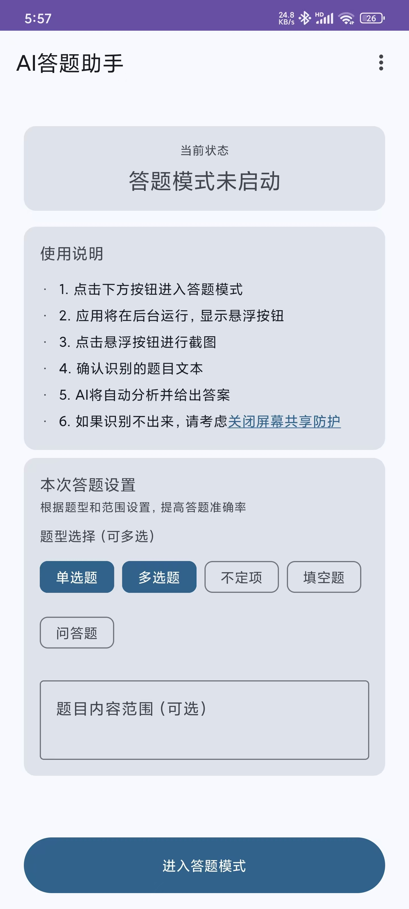
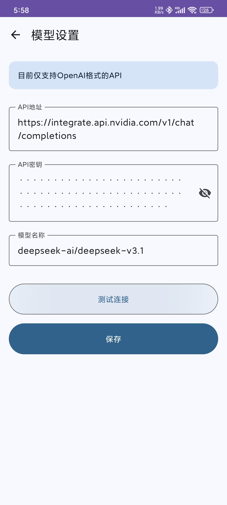
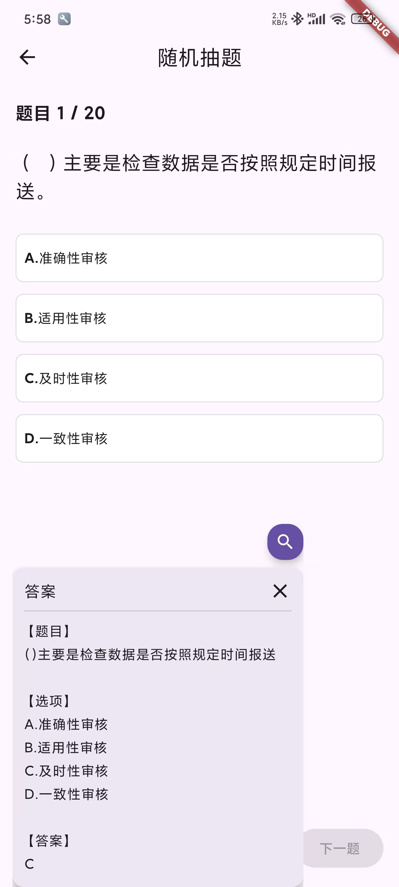
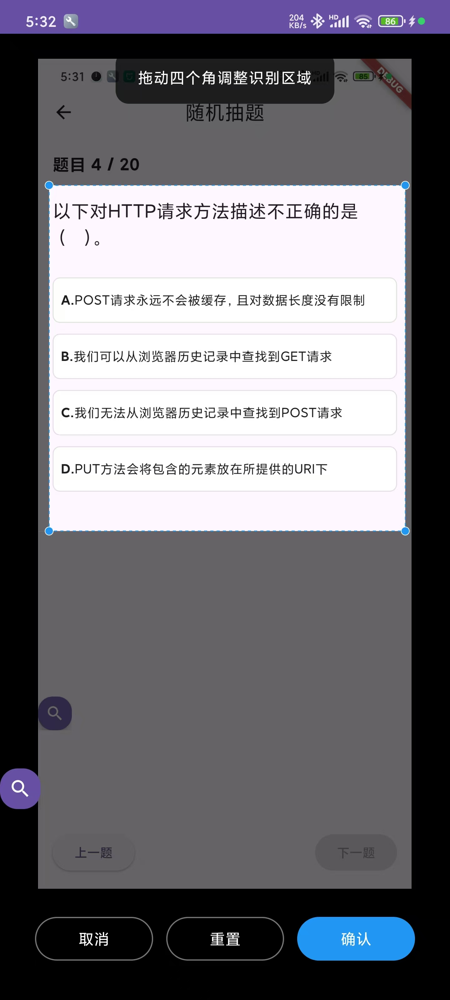

# AI答题助手 (AIAnswerer)

[中文](#中文使用指南) | [English](README_EN.md)

## 中文使用指南

### 应用简介
AI答题助手是一款基于 OCR 与大语言模型的安卓答题工具。通过悬浮窗截图识别题目，并调用 DeepSeek AI 等兼容 OpenAI 接口的模型为你快速给出答案，适用于练习、查缺补漏或自测场景。

   

### 功能亮点
- 🖼️ 屏幕快速截取：一键截取当前屏幕，自动聚焦题目区域
- 📝 智能文字识别：支持中英文识别，可在提交前编辑校正
- 🤖 AI 实时答题：根据题型生成解析，并自动复制答案
- 💬 悬浮窗操作：无需切换应用即可完成截屏、预览、提交
- 🔒 本地可控：自定义 API Key，随时启停网络请求

### 安装与准备
1. 使用 Android 11 及以上系统的设备，并保持网络通畅。
2. 安装提供的 APK 文件；首次安装需按照系统提示允许来自未知来源的应用。
3. 设置 LLM 模型信息。
4. 首次启动时，按照屏幕提示授予悬浮窗、截屏和通知等必要权限。

### 快速上手
1. 参考应用内说明

### 支持的题型
- 选择题：识别题干与选项，标记推荐答案并给出理由
- 填空题：生成精炼答案，适用于多空位题目
- 问答题：提供结构化解答或要点式分析

### 使用小贴士
- 保持截图清晰、居中，避免复杂背景，以提升 OCR 准确率。
- 如需暂停网络请求，可暂时断网或在设置页关闭 AI 回答。
- 答案生成后可再次点击悬浮按钮刷新题目，便于连续练习。

### 常见问题
- **提示缺少权限？** 前往系统设置搜索“悬浮窗”“屏幕录制”等选项，手动开启相关权限。
- **识别不准确？** 在确认页手动修正文本，或重新截图后再提交。
- **AI 没有回应？** 检查网络、确认 API Key 有效，并确保 DeepSeek 账户余额充足。

### 待完成
- ~~精准框选答题区域（微信读书等）~~
- 自定义题库/知识库（内部文档、技术文档、网站等）
- github action 自动打包
- 优化prompt、自定义prompt

### 隐私与免责声明
- 应用会将识别出的文字发送至所选 AI 服务，请避免上传敏感或受限内容。
- DeepSeek API 请求可能产生费用，请留意使用频率。
- 本应用仅用于学习与研究，请遵守考试纪律和法律法规，任何违规使用后果自负。

### 更新说明
#### v0.3
* 加入COR 前裁剪功能，提高题目识别能力

#### v0.2
* 修复release 包无法请求ai api 的问题

#### v0.1
* 初次发版

### License
This project is released under the [MIT License](/LICENSE)
